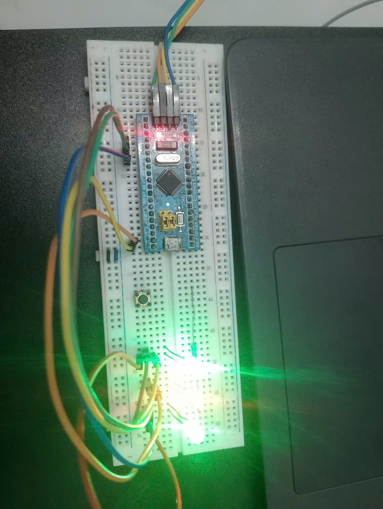

# Sử dụng FreeRTOS để nhấp nháy 3 LED ở 3 tần số khác nhau
## Mục đích

Bài thực hành giúp sinh viên làm quen với hệ điều hành thời gian thực FreeRTOS trên vi điều khiển STM32F103.
Thông qua bài tập, chúng ta sẽ:

- Hiểu cơ chế đa nhiệm (multitasking) trong FreeRTOS.

- Biết cách tạo nhiều tác vụ (task) độc lập.

- Sử dụng hàm vTaskDelay() để quản lý thời gian trễ trong mỗi task.

- Thực hành điều khiển nhiều LED với các tần số khác nhau một cách song song.

## Ý tưởng

- Sử dụng 3 task riêng biệt để điều khiển 3 LED.

- Mỗi task đảm nhiệm 1 LED và có chu kỳ nhấp nháy khác nhau:

  -  LED1: 3 Hz (chu kỳ 333 ms)

  - LED2: 10 Hz (chu kỳ 100 ms)

  - LED3: 25 Hz (chu kỳ 40 ms)

- Dùng hàm vTaskDelay() để tạo khoảng trễ giữa các lần đảo trạng thái LED.

- Các task được tạo bằng xTaskCreate(), sau đó scheduler của FreeRTOS tự động quản lý việc chuyển đổi giữa chúng.

## Cấu hình phần mềm

- IDE sử dụng: Keil uVision / STM32CubeIDE.

- Thư viện:

  - FreeRTOS Kernel (thư mục FreeRTOS/FreeRTOS-Kernel/).

  - Thư viện chuẩn STM32F10x Standard Peripheral Library.

- Tệp cấu hình: 
  - FreeRTOSConfig.h chứa các thiết lập như configCPU_CLOCK_HZ, configTICK_RATE_HZ, configMINIMAL_STACK_SIZE, …

## Cấu hình phần cứng

- Vi điều khiển: STM32F103C8T6 (Blue Pill).

- 3 LED ngoài nối với các chân:

  - LED1 → PC13

  - LED2 → PC14

  - LED3 → PC15

## Mô tả chương trình

- Khởi tạo GPIO:

  - Bật clock cho cổng GPIOC.

  - Cấu hình các chân PC13, PC14, PC15 ở chế độ Output Push-Pull, tốc độ 2 MHz.

- Tạo các task:

  - Mỗi task điều khiển 1 LED.

  - Trong vòng lặp while(1), LED được đảo trạng thái (GPIOC->ODR ^= GPIO_Pin_x) và dừng trong thời gian tương ứng (bằng vTaskDelay()).

- Khởi động scheduler:

  - Gọi vTaskStartScheduler() để bắt đầu chạy các task song song.

- Ứng dụng thực tế

  - Mô phỏng nhiều tiến trình chạy song song trong hệ thống nhúng.

  - Là bước nền để học các bài nâng cao: điều khiển sensor, LCD, UART bằng task.

  - Làm cơ sở cho ứng dụng điều khiển nhiều thiết bị đồng thời trong hệ thống IoT

**Source code:** [Bài 11.1](main.c)  

**Video Demo:** [Demo EX10](https://drive.google.com/file/d/1TGZXjy8vQ2uARfhg47MrhXTECS0gZ88F/view?usp=drive_link)

