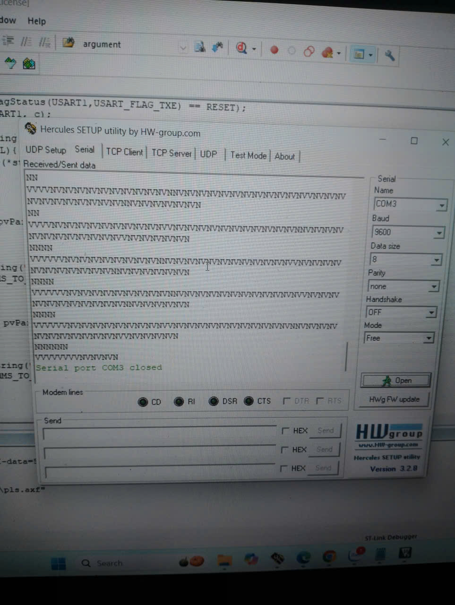

# Bài 2: Hai Task Cùng Gửi Dữ Liệu Qua UART (Không sử dụng Mutex)

---

## 1. Yêu Cầu

* Viết chương trình có **2 Task** cùng gửi chuỗi dữ liệu ra UART1.
* Mỗi Task gửi một chuỗi khác nhau, ví dụ:
  * Task1 gửi một chuỗi ký tự
  * Task2 cũng cùng gửi một chuỗi ký tự khác
* Hiển thị rõ được sự **xung đột dữ liệu** khi cả hai Task cùng gửi dữ liệu qua UART.
* Dữ liệu được hiển thị qua Terminal

---

## 2. Ý Tưởng

* Sử dụng **FreeRTOS** để tạo 2 Task cùng chạy song song, cùng gọi hàm truyền UART.
* Sử dụng UART là **tài nguyên dùng chung**, khi không có cơ chế đồng bộ (mutex/semaphore), hai luồng dữ liệu có thể bị **xen kẽ hoặc lỗi hiển thị**.
* Thấy được sự **xung đột tài nguyên** trong hệ thống đa nhiệm.

---

## 3. Cấu Hình Phần Cứng Và Phần Mềm 

| Thành phần | Chức năng                 | Kết nối  |
| ---------- | ------------------------- | ------------- |
| UART1_TX   | Truyền dữ liệu            | PA9           |
| UART1_RX   | Nhận dữ liệu              | PA10          |
| MCU        | STM32F103C8T6 (Blue Pill) |               |
| Terminal   | Hiển thị dữ liệu UART     

**Công cụ:** Keil uVision 5 + Ngôn ngữ **C**

---

## 4. Cấu Hình Chương Trình

### **4.1. Cấu hình UART1**

* Baudrate: **9600**
* Word length: **8 bit**
* Mode: **Tx + Rx**

### **4.2. Cấu hình Task**

| Task  | Chức năng        | Chuỗi gửi | Thời gian gửi |
| ----- | ---------------- | --------- | ------------ |
| Task1 | Gửi dữ liệu UART | “VVVV...” | 100 ms       |
| Task2 | Gửi dữ liệu UART | “NNNN...” | 100 ms       |

---

## 5. Mô Tả Chương Trình

**Cấu trúc hàm main**

```c
xTaskCreate(Task1, "Task1", 128, NULL, 1, NULL);
xTaskCreate(Task2, "Task2", 128, NULL, 1, NULL);
vTaskStartScheduler();
```

* Mỗi Task đều sử dụng chung hàm `USART1_SendString()`.
* Hai Task có cùng mức ưu tiên → Scheduler luân phiên chuyển ngữ cảnh (context switching).
* Vì không có **mutex**, việc gửi UART bị xen kẽ giữa 2 Task → hiển thị lẫn lộn trên terminal.

---

## 6. Kết Quả Hiển Thị

* Khi chạy chương trình, terminal sẽ hiển thị bị lỗi, xen kẽ giữa 2 chuỗi
* Hai chuỗi bị xen kẽ, một Task gửi hết chuỗi trước rồi mới đến Task khác, nhiều lúc xen kẽ từng ký tự.
* Hiện tượng **xung đột truy cập tài nguyên UART** do không có **Mutex bảo vệ**.

---

## **7. Nhận xét**

* Khi nhiều Task cùng truy cập **tài nguyên dùng chung (UART, I2C, SPI, LCD...)**, cần có cơ chế đồng bộ như **Mutex hoặc Semaphore**.
* Không dùng đồng bộ → dễ gây **lỗi truyền, mất dữ liệu hoặc nhiễu hiển thị**.
* Thể hiện rõ ràng sự **xung đột tài nguyên trong FreeRTOS**.
* FreeRTOS cho phép nhiều Task hoạt động song song, nhưng cần sử dụng hiệu quả và hợp lý để chia sẻ tài nguyên.

---

**Hình ảnh hiển thị:**



**Video Demo:** [Link](https://drive.google.com/drive/folders/19U7jRkqjUVH6kjL8KimZb8kITfMR30vp?usp=sharing)


