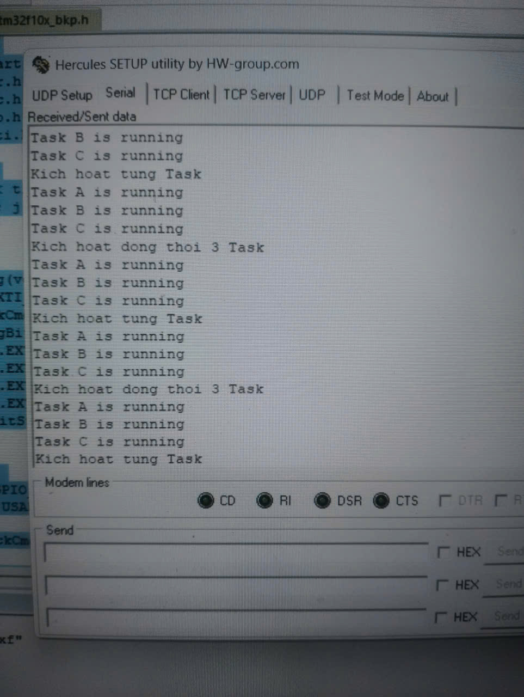

# Bài Tập 1: Sử Dụng Cơ Chế EVENT GROUPS Trong FREERTOS

---

## 1. Yêu Cầu
Viết chương trình sử dụng **cơ chế Event Groups** trong FreeRTOS. Có **1 Task chính** điều phối hoạt động của **3 Task con** còn lại theo tiến trình quy định.  
Chương trình phải thể hiện được cả hai dạng:
- **Kích hoạt đơn**: từng Task hoạt động tuần tự.
- **Kích hoạt đồng thời**: nhiều Task cùng hoạt động trong một lần kích hoạt.  

Các Task sau khi được kích hoạt sẽ thực hiện hành động tương ứng và gửi thông báo qua cổng **UART1**.

---

## 2. Mục Đích
Bài tập giúp sinh viên hiểu rõ cách:
- Sử dụng **Event Groups** để đồng bộ hóa và quản lý nhiều Task trong FreeRTOS.
- Áp dụng cơ chế **Semaphore (Mutex)** để tránh xung đột tài nguyên khi nhiều Task cùng truy cập UART.
- Củng cố kiến thức về cấu trúc Task, cơ chế delay (`vTaskDelay`), và hoạt động của Event Group trong hệ điều hành thời gian thực.

---

## 3. Ý Tưởng 
Chương trình có bốn Task chính:
1. **TaskMain**: đóng vai trò điều phối trung tâm, thực hiện set các bit trong Event Group để lần lượt kích hoạt các Task con.
2. **TaskA**, **TaskB**, **TaskC**: mỗi Task sẽ chờ một bit riêng trong Event Group. Khi bit tương ứng được set, Task đó thực thi công việc (in ra thông báo qua UART) rồi tự xóa bit sự kiện (sử dụng `pdTRUE`).
3. Sau khi kích hoạt tuần tự 3 Task, TaskMain sẽ kích hoạt đồng thời cả 3 Task bằng cách set cùng lúc 3 bit sự kiện.

Cơ chế **xEventGroupSetBits()** và **xEventGroupWaitBits()** được dùng để truyền tín hiệu giữa các Task.  
Cơ chế **Mutex (xSemaphoreCreateMutex)** được dùng để đảm bảo chỉ một Task được quyền gửi dữ liệu UART tại một thời điểm, tránh lỗi in chồng chuỗi.

Luồng hoạt động tổng quát:
1. TaskMain kích hoạt Task A → UART hiển thị "Task A is running".
2. Sau 1 giây, TaskMain kích hoạt Task B → UART hiển thị "Task B is running".
3. Sau 1 giây, TaskMain kích hoạt Task C → UART hiển thị "Task C is running".
4. Sau đó, TaskMain kích hoạt đồng thời cả 3 Task → UART hiển thị thông báo từ cả ba Task.
5. Chu trình được lặp lại liên tục, minh họa cơ chế đồng bộ hóa của Event Groups.

---

## 4. Cấu Hình Phần Cứng Và Phần Mềm

**Phần cứng:**
- Vi điều khiển: STM32F103C8T6 (Blue Pill)
- Xung hệ thống: 72 MHz
- UART1: TX → PA9, RX → PA10
- Baudrate: 9600 bps

**Phần mềm:**
- IDE: Keil µVision 5 hoặc STM32CubeIDE  
- Hệ điều hành: FreeRTOS  
- Thư viện: STM32F10x Standard Peripheral Library

**Các thành phần chính trong chương trình:**
- **RCC_Config()**: cấu hình xung clock và cấp nguồn cho GPIO, USART.
- **USART1_Config()**: cấu hình UART1 ở tốc độ 9600 bps, 8N1.
- **UART1_SendString()**: hàm gửi chuỗi dữ liệu qua UART.
- **xEventGroupCreate()**: tạo Event Group.
- **xSemaphoreCreateMutex()**: tạo Mutex bảo vệ UART.
- **xTaskCreate()**: tạo các Task (Main, A, B, C).
- **vTaskStartScheduler()**: khởi động bộ lập lịch của FreeRTOS.

---

## 5. Mô Tả Chương Trình

Sau khi khởi tạo hệ thống và UART, chương trình tạo Event Group cùng với Mutex để bảo vệ UART.  
TaskMain hoạt động với độ ưu tiên cao nhất, chịu trách nhiệm phát tín hiệu điều khiển thông qua việc set các bit trong Event Group:

- `BIT_TASKA` → Kích hoạt TaskA  
- `BIT_TASKB` → Kích hoạt TaskB  
- `BIT_TASKC` → Kích hoạt TaskC  

Các Task con sử dụng `xEventGroupWaitBits()` để chờ các bit tương ứng được kích hoạt. Khi một Task nhận được tín hiệu, nó sẽ:
1. Lấy Mutex để truy cập UART.
2. Gửi chuỗi thông báo “Task X is running”.
3. Trả lại Mutex.
4. Delay trước khi tiếp tục vòng lặp chờ tín hiệu mới.

TaskMain sau khi lần lượt kích hoạt 3 Task riêng lẻ, sẽ set đồng thời 3 bit để kích hoạt tất cả cùng một lúc, giúp minh họa cơ chế “multi-event activation”.

---

## 6. Kết quả 

- Các Task hoạt động đúng thứ tự theo EventBits.  
- Khi kích hoạt đồng thời, cả ba Task cùng chạy song song mà không xung đột.  
- Giao tiếp và đồng bộ ổn định giữa các Task qua Event Group.

---

## 7. Nhận Xét Và Đánh Giá

- Cơ chế **Event Groups** giúp đồng bộ hóa hiệu quả nhiều Task, đảm bảo quá trình điều phối được chính xác mà không cần sử dụng Queue hoặc Semaphore phức tạp.  
- **Mutex bảo vệ UART** hoạt động ổn định, ngăn ngừa lỗi khi nhiều Task cùng gửi dữ liệu.  
- **FreeRTOS Delay** (`vTaskDelay`) được sử dụng hợp lý để tạo khoảng cách giữa các lần kích hoạt.  
- Cấu trúc chương trình rõ ràng, dễ mở rộng cho các ứng dụng phức tạp hơn như điều khiển thiết bị, cảm biến, hoặc hệ thống giao tiếp đa luồng.  
- Kết quả thực tế trùng khớp với mô phỏng, thể hiện đúng nguyên lý hoạt động của Event Groups trong FreeRTOS.

---

**Hình ảnh thực tế:**

**Video Demo:** [Link](https://drive.google.com/drive/folders/18AB3U_aaBF28kigNuzHOAKb5ejsTVPNG?usp=sharing)

