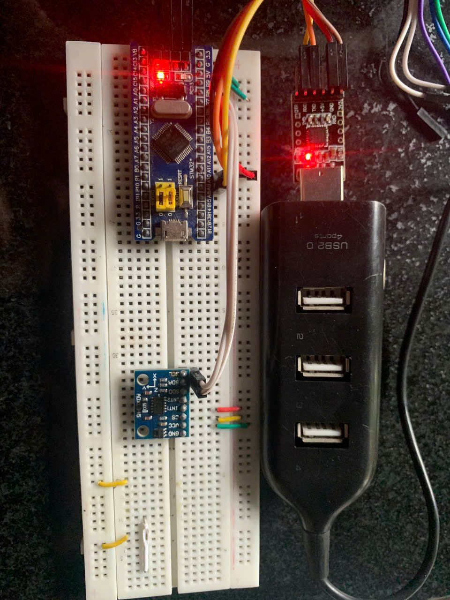

### Cấu hình STM32 là Master I2C.Giao tiếp với một EEPROM hoặc cảm biến I2C để đọc/ghi dữ liệu. Hiển thị dữ liệu đọc được lên màn hình terminal qua UART."

##  Mục đích
- Làm quen với việc cấu hình giao tiếp **I2C** ở chế độ Master trên STM32.  
- Hiểu nguyên lý hoạt động của I2C và vai trò Master/Slave.  
- Biết cách truyền và nhận dữ liệu với thiết bị ngoại vi I2C (EEPROM, ADXL345...).  
- Thực hành hiển thị dữ liệu lên **UART terminal** để kiểm chứng kết quả.  

## Ý tưởng
- STM32F103 được cấu hình làm **I2C Master**.  
- Thiết bị ngoại vi (EEPROM hoặc ADXL345) đóng vai trò **I2C Slave**.  
- Trình tự giao tiếp:  
  - Master gửi địa chỉ và thanh ghi muốn truy cập.  
  - Ghi dữ liệu xuống thiết bị.  
  - Đọc dữ liệu từ thiết bị.  
- Dữ liệu đọc được sẽ được gửi ra **UART1** và hiển thị trên terminal (PC).  

## Cấu hình
**I2C:**
- **Clock**: bật `RCC_APB2Periph_GPIOB` và `RCC_APB1Periph_I2C1`.  
- **GPIO**:  
  - PB6 → I2C1_SCL (Clock)  
  - PB7 → I2C1_SDA (Data)  
  - Chế độ: Alternate Function, Open-Drain.  
- **Thông số**:  
  - Tốc độ: 100 kHz (Standard mode).  
  - Địa chỉ Master: 7-bit.  
  - ACK: Enable.

**UART:**
- **Clock**: bật `RCC_APB2Periph_GPIOA` và `RCC_APB2Periph_USART1`.  
- **GPIO**:  
  - PA9 → TX (kết nối USB-TTL RX).  
  - PA10 → RX (kết nối USB-TTL TX).  
- **Thông số**:  
  - Baudrate: 9600.  
  - Data bits: 8.  
  - Stop bit: 1.  
  - Parity: None.  

 

**Source code:** [Bài 6](RQ2.c)  

**Video Demo:** [DEMO](https://drive.google.com/file/d/1lrmTQHrL5aBrYNV21NOO-3OGtNQVIlpt/view?usp=drive_link)

