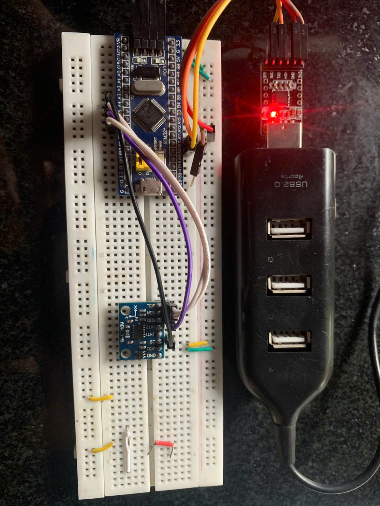

# I. Cấu hình STM32 là Master SPI
## 1. Mục đích
- Cấu hình **STM32F103** làm **Master SPI**.  
- Thiết lập GPIO cho SPI1 (SCK, MISO, MOSI, CS).  
- Chuẩn bị giao tiếp với các thiết bị ngoại vi SPI

---

## 2. Lý thuyết SPI
- SPI là giao tiếp nối tiếp đồng bộ, gồm 4 tín hiệu:  
  - **SCK**: Clock từ Master.  
  - **MOSI**: Master → Slave.  
  - **MISO**: Slave → Master.  
  - **CS**: chọn Slave (mức LOW khi giao tiếp).  
- STM32F1 hỗ trợ nhiều mode SPI, ví dụ mode 0 và mode 3.  

---

## 3. Sơ đồ kết nối cơ bản
| STM32F103 | Thiết bị SPI |
|-----------|--------------|
| PA5 (SCK) | SCK |
| PA6 (MISO)| MISO|
| PA7 (MOSI)| MOSI|
| PA4 (CS)  | CS  |

---

## 4. Code
- **GPIO_Config()**: cấu hình PA5, PA7 (AF_PP), PA6 (IN_FLOATING), PA4 (Output Push-Pull).  
- **SPI1_Config()**:  
  - Master mode, 8-bit, full duplex.  
  - CPOL=1, CPHA=1 (SPI mode 3).  
  - Baudrate = fPCLK/16 (~4.5MHz).  
  - MSB first.  
- **main()**: gọi `GPIO_Config()` và `SPI1_Config()`, chờ sẵn cho các thao tác truyền/nhận SPI.  

---

**Source code:** [Code](7.1.c) 

# II. Cấu hình SPI trên STM32F1 kết nối với module SPI (ADXL345). Gửi một byte dữ liệu và nhận phản hồi, hiển thị dữ liệu lên terminal.
## 1. Mục đích
- Cấu hình **STM32F103** làm **Master SPI**.  
- Kết nối với cảm biến **ADXL345** qua SPI.  
- Đọc thanh ghi **DEVID (địa chỉ 0x00)** để kiểm tra kết nối.  
- Hiển thị dữ liệu đọc được (0xE5) lên terminal thông qua UART.  

---

## 2. Lý thuyết cơ bản

### 2.1. SPI (Serial Peripheral Interface)
- SPI là giao thức truyền dữ liệu nối tiếp đồng bộ (synchronous).  
- 4 đường tín hiệu chính:
  - **SCK**: Clock (do Master tạo).  
  - **MOSI**: Master Out – Slave In.  
  - **MISO**: Master In – Slave Out.  
  - **CS/SS**: Chip Select, mức thấp khi giao tiếp.  
- ADXL345 sử dụng **SPI mode 3** (CPOL=1, CPHA=1).  

### 2.2. UART (Universal Asynchronous Receiver/Transmitter)
- UART truyền dữ liệu không đồng bộ, thường dùng để debug.  
- Thông số chuẩn:
  - Baudrate = 9600  
  - 8 data bits, 1 stop bit, no parity (8N1)  

### 2.3. Thanh ghi DEVID – ADXL345
- Địa chỉ: `0x00`  
- Chỉ đọc (read-only).  
- Luôn trả về giá trị **0xE5**.  
- Mục đích: kiểm tra kết nối phần cứng và cấu hình SPI đúng.  

---

## 3. Sơ đồ kết nối STM32F103C8T6 – ADXL345 (SPI)

| STM32F103 | ADXL345 |
|-----------|---------|
| PA5 (SPI1_SCK)  | SCL/SCLK |
| PA6 (SPI1_MISO) | SDO      |
| PA7 (SPI1_MOSI) | SDA/SDI  |
| PA4 (GPIO – CS) | CS       |
| 3.3V             | VCC      |
| GND              | GND      |

 
---

## 4. Mô tả chương trình

1. **Khởi tạo GPIO** cho SPI và CS.  
2. **Cấu hình SPI1**: Master, 8 bit, mode 3, baudrate ~4.5MHz.  
3. **Cấu hình UART1**: baudrate 9600 để in dữ liệu ra PC.  
4. **Trong vòng lặp chính**:
   - Kéo CS xuống LOW.  
   - Gửi byte `0x80 | 0x00 = 0x80` để yêu cầu đọc thanh ghi DEVID.  
   - Gửi 1 byte dummy (`0x00`) để nhận dữ liệu trả về.  
   - Nhả CS lên HIGH.  
   - In giá trị đọc được qua UART.  
5. **Kết quả nhận được**: Terminal sẽ hiển thị

**Source code:** [Bài 7](7.2.c)  

**Video Demo:** [Demo](https://drive.google.com/file/d/1kkN5NX923quCowhPOLtsPBhzEQKVJW5f/view?usp=sharing)  

