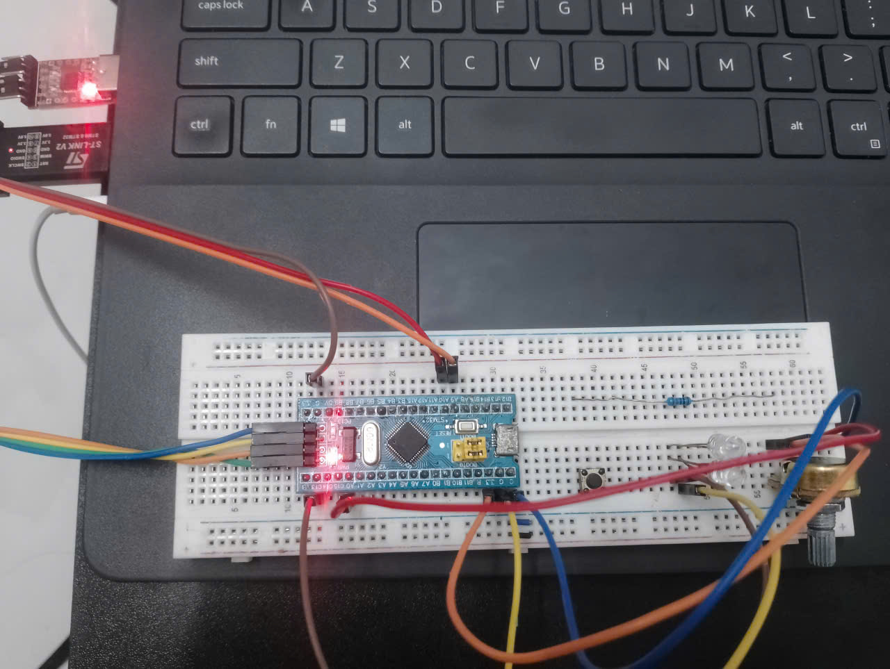

## 1. Cấu hình DMA để truyền dữ liệu từ ADC vào bộ nhớ RAM

###  Mục đích
- Sử dụng DMA để tự động truyền dữ liệu từ ADC sang RAM mà không cần CPU xử lý từng mẫu.  
- Giúp tiết kiệm tài nguyên CPU và đảm bảo thu thập dữ liệu liên tục.  

###  Ý tưởng
- Cấu hình ADC1 ở chế độ **continuous** để lấy mẫu tín hiệu analog từ chân PA0 (ADC1_IN0).  
- Mỗi giá trị ADC sau khi convert xong sẽ được DMA **tự động copy** từ thanh ghi `ADC1->DR` sang buffer trong RAM.  
- Chọn chế độ **Normal** để DMA chỉ truyền đúng một khối dữ liệu (ví dụ 100 mẫu), sau đó dừng.  

###  Cấu hình
- ADC1:  
   Kênh: PA0 (ADC1_IN0).  
  Độ phân giải: 12-bit (0–4095).  
   Chế độ: Continuous conversion.  
  Vref: 3.3V.  
- DMA1 Channel1:  
   Peripheral address: `ADC1->DR (0x4001244C)`.  
  Memory address: mảng `buffer[]` trong RAM.  
   Buffer size: 50.  
  Data size: Half-word (16-bit).  
   Mode: Normal.  
  Priority: High.
# 2. Khi quá trình truyền hoàn tất, ngắt được kích hoạt để xử lý dữ liệu. Hiển thị dữ liệu lên terminal.

##  Mục đích
- Làm quen với việc sử dụng **DMA** để truyền dữ liệu từ **ADC** vào RAM mà không cần CPU can thiệp từng mẫu.  
- Hiểu cơ chế **ngắt DMA** khi quá trình truyền hoàn tất.  
- Thực hành việc **hiển thị dữ liệu ADC** (dạng giá trị số hoặc điện áp mV) lên **terminal** qua UART.  
## Ý tưởng
1. **ADC1** đọc giá trị analog từ một biến trở .  
2. **DMA1 Channel1** tự động copy dữ liệu từ **ADC1->DR** sang buffer trong RAM.  
3. Khi DMA truyền đủ số mẫu, cờ **Transfer Complete (TC)** bật → phát sinh **ngắt DMA**.  
4. Trong hàm xử lý ngắt, đặt cờ báo hiệu để vòng lặp chính biết dữ liệu đã sẵn sàng.  
5. Vòng lặp chính xử lý (tính trung bình, đổi sang mV, …) và gửi kết quả qua **UART1** đến terminal (Hercules).  
## Cấu hình  
- UART:  
   PA9 (TX) → RX CP2102/CH340 (PC)  
   PA10 (RX) → TX CP2102/CH340 
  GND MCU ↔ GND USB–UART  

- ADC1  
  Kênh: PA0 (ADC1_IN0)  
  Độ phân giải: 12-bit (0–4095)  
  Chế độ: Continuous  
  Vref = 3.3V  

- DMA1 Channel1 
   Nguồn: ADC1->DR (0x4001244C)    
   Chế độ: Normal  
   Ngắt: Transfer Complete (TC)  

- USART1  
   Baudrate: 9600 (8N1)  
  Mode: Tx (gửi dữ liệu lên terminal) 
## Kết nối phần cứng 
- MCU: STM32F103C8T6 (Blue Pill).  
- Biến trở 5kΩ:  
   1 đầu → 3.3V  
   1 đầu → GND  
   Chân ở giữa → PA0 (ADC1_IN0)  
- UART:  
   PA9 (TX) → RX CP2102 
   PA10 (RX) → TX CP2102  
   GND MCU ↔ GND USB–UART  

 
**Source code:** [Bài 9](9.2.c)  

**Video Demo:** [DEMO](https://drive.google.com/file/d/1nD1WP0Xt8vIYjJJAmk1fNA1_yn9DVtD5/view?usp=sharing)
